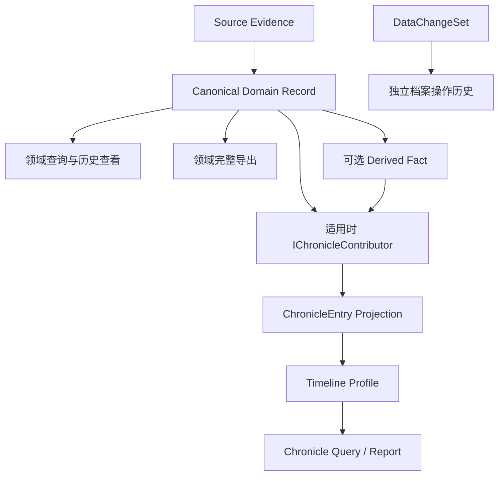

# Chronicle 时间线架构

状态：Accepted target

## 目的

Chronicle 是 FurinaChronicle 对已有领域事实进行筛选、组合和叙事展示的综合派生视图，把适合时间叙事的长期数据组织为可追溯的玩家历程。它服务“本地优先的原神个人历史档案工具”，不是领域数据存在的理由或唯一读取渠道。

时间线不是新的事实来源，也不是把所有业务记录复制进一张万能表。各数据域仍保存自己的规范化记录；时间线由这些记录构建为可重建的投影。Chronicle 也不等于“显示所有记录”：主时间线只挑选重要节点，角色、武器、挑战等领域时间线可以使用不同的默认颗粒度。

遵循领域自治、数据优先、开放导出、Chronicle 派生。各领域先独立保存、查询、查看历史和导出，再选择参与 Chronicle；Contributor 不是领域成立的必要条件，完整领域导出不通过时间线完成。作用域见 [ADR 0011](../decisions/0011-domain-first-product-scope.md)。

## 两类历史必须分离

### 游戏历程

回答“玩家的游戏账号在什么时候发生或呈现了什么”：

- 抽到物品；
- 完成成就；
- 参与一期挑战并取得结果；
- 角色或武器在两个观察点之间发生变化；
- 背包或资源数量发生变化；
- 完成日常、周常或一次游玩会话。

它以 `OccurredAt`、状态观察区间或业务周期为时间依据。

### 档案操作历史

回答“FurinaChronicle 在什么时候怎样修改了本地档案”：

- 刷新、导入、覆盖或手工纠正；
- 删除、撤销或恢复；
- 导出、备份和同步操作。

它以 `DataChangeSet`、`OperationHistory` 和未来的 `ChangeJournal` 为依据。`ImportedAt`、`FetchedAt` 或操作发生时间不得冒充游戏事实发生时间。

两个时间线可以在 UI 中互相跳转，但不得合并为同一可信层级。

## 数据流



`ChronicleEntry` 只保存展示和查询所需的引用、时间、摘要和来源信息。完整字段和证据始终回到所属数据域读取。

## 候选事件与可见性 Profile

贡献者把规范化事实投影为候选 `ChronicleEntry`；时间线 Profile 再决定某类条目是否默认可见。两层必须分离：

- “主时间线不显示”不表示该事实可以不保存；参与领域时间线的候选事件与默认可见性分离，未参与 Chronicle 的事实仍按领域策略保存、查询和导出；
- 主时间线默认只显示五星抽取、四星角色首次/第七次获取、挑战完成和重要成就等节点；
- 角色时间线、武器时间线和挑战时间线可以展示更细的领域事件；
- 用户提高颗粒度只改变查询和展示，不改写规范化事实；
- 以后新增时间线若未另行说明，默认只有文本模式。

具体产品行为以 [Chronicle 产品需求](../specifications/CHRONICLE_PRODUCT_REQUIREMENTS.md) 为准。

## 时间表达

游戏历程至少需要以下时间形态：

| 形态 | 示例 | 必需字段 |
|---|---|---|
| `Instant` | 一次抽卡 | `StartAt` |
| `Interval` | 一次游玩会话、挑战周期 | `StartAt`、`EndAt` |
| `UncertainInterval` | 两次状态观察间首次发现角色升级 | 最早可能时间、最晚可能时间 |

`TemporalExtent` 只在已知业务发生时间或范围时存在。若来源只提供采集时间，则 `OccurredAt` 保持未知，另以 `ObservedAt` 或 `FetchedAt` 形成排序锚点；UI 必须显示“采集于/观察于”，不得伪装成精确完成时间。

每个已知时间范围还应包含：

- `Precision`：精确、分钟、日期、周期、两次观察之间或未知；
- `TimeBasis`：来源偏移、服务器时区、用户时区或未知；
- 原始偏移量：存在时保留，内部比较仍统一使用 UTC `DateTimeOffset`；
- `SortAt`：排序锚点，不取代真实时间范围；必须同时记录它采用 `Occurred`、`Observed` 或 `Fetched` 中哪一种依据。

排序锚点的默认规则：

- 瞬时事件取 `StartAt`；
- 确定区间取 `StartAt`；
- 不确定区间取最晚可能时间，并在 UI 中明确显示完整范围；
- 不知道发生时间时依次取 `ObservedAt`、`FetchedAt`，并在 UI 中明确其时间语义。

不得用 `ObservedAt` 猜测精确的 `OccurredAt`。只有来源确实提供业务发生时间时，才允许生成精确瞬时事件。

## 投影契约

EntryId、ProjectionSequence、Profile、排序锚点和游标属于 Chronicle 子系统。只有真正共同的 Identity、Time、Provenance、Completeness 等语义进入共享基础，不能为 Chronicle 查询方便反向塑造领域事实。具体字段在 Chronicle 工作包评审；更早持久化/公开使用的部分须先冻结。

概念上的 `ChronicleEntry` 至少包含：

- 稳定的 `EntryId`；
- 可跨导入/同步识别来源事实的可移植实体键（存在时）；
- 档案内 `GameAccountId` 与数据域；
- 所属时间线 Profile、里程碑类型和默认重要级别；
- 条目类型和时间范围；
- `DataOrigin`、`Confidence`、`Completeness`；
- 规范化记录或派生事实的稳定引用；
- 可选的 `CorrelationId`；
- 本地化无关的标题键、摘要参数和重要级别；
- 投影版本与稳定排序键。

`EntryId` 是某个本地账号副本内的投影身份，必须由数据域、来源实体身份和投影版本生成，不得依赖显示名称、图片 URL 或本地化文本。跨档案导入或跨设备同步不得依赖包含本地 `GameAccountId` 的 `EntryId`，而应使用规范化事实的自然键或可移植实体键。

各数据域通过小型贡献者接口参与：

```text
IChronicleContributor<TRecord>
    Project(record, context) -> zero or more ChronicleEntry

IChronicleQueryService
    Query(scope, filters, cursor, pageSize) -> ChroniclePage
```

一个业务记录可以不产生时间线条目，也可以产生多个条目。贡献者不得反向修改规范化记录。

## 数据域映射

| 数据域 | 规范化事实 | 时间线表现 |
|---|---|---|
| 抽卡 | 单条抽卡记录 | 每次五星进入主时间线；四星角色首次和第七次获取进入主时间线；角色/武器时间线可提高颗粒度 |
| 成就 | 解锁状态与时间 | 重要成就进入主时间线；其他成就保留领域事实并可供以后专门时间线使用 |
| 挑战 | 一期中内容发生变化的官方记录观察 | 首次完成一期挑战进入主时间线；每次不同观察进入挑战时间线，结果摘要不丢弃原详情 |
| 角色/武器 | 某次完整或部分状态观察 | 观察点；差异形成显式 `Derived` 条目 |
| 背包 | 快照或官方流水 | 观察点、官方事件或推断差异，来源等级分离 |
| 经济 | 官方流水或余额观察 | 官方事件或不确定区间内的派生净变化 |
| 实时便签 | 状态观察 | 默认低重要级别观察；按保留策略降采样 |
| 游玩会话 | 进程或系统观察 | 确定或近似区间 |

角色/武器和挑战将作为基础架构完成后的首批独立验证域，先证明状态/观察历史查询和开放导出，再验证 Chronicle。上表对后续领域的映射只表示可能消费方式，不要求背包、经济或高频观察的全部数据进入时间线，也不决定它们的保留级别。

## 关联与聚合

`CorrelationId` 只表示若干条目属于同一用户可理解的上下文，例如一次十连、一期深境螺旋、一次刷新批次发现的多个状态变化。它不改变条目的独立身份和来源。

聚合是查询选项而不是写入规则。日、周、版本和活动聚合必须能展开回规范化记录。统计卡片、趋势图和“同一天发生了什么”都属于投影。

## 查询、分页和性能

- 支持账号、档案、时间线 Profile、显示颗粒度、数据域、条目类型、时间范围、来源、可信度、重要级别、物品和星级过滤；
- 默认按 `SortAt DESC, EntryId DESC` 排序；
- 使用带查询快照序列的键集游标分页，不用随数据变化漂移的页码作为持久游标；仅有 `SortAt + EntryId` 不足以阻止刷新期间的旧时间记录插入后续页面；
- 档案模式聚合多个账号，但每个条目仍保留账号归属；
- 物品图标和横幅图片按需加载，不进入时间线主体；
- 数据量需要时可以维护可重建的 `ChronicleIndex`，损坏或版本变化时从业务数据重建。

是否启用物化索引是性能决策，不改变公开数据语义。第一版允许直接查询各数据域并在服务层归并。

本节是 Chronicle 实施门槛，不是整个 8B.0 的前置条件。修订、撤销、删除、重建及 Profile 变化时的序列/游标生命周期须在 8B.6 验证，不能把新插入记录的稳定分页方案直接当作完整历史快照承诺。

## 修订与删除

- 时间线默认显示规范化记录的当前有效版本；
- 被替代版本只在档案操作历史或记录详情中查看；
- 撤销后重新构建受影响投影；
- 不可逆删除后不得从 Revision 恢复具体数据；仅保留的 `LocalOnlyTombstone` 不生成包含隐私内容的游戏历程条目。

## 导出、备份和同步

- 各领域直接提供标准、Furina 机器可读载荷和适用的人类可读导出；不经 Chronicle 也能带走完整领域数据；
- Furina Dataset 和同步协议传输各数据域的规范化事实、来源和必要修订信息，不把 `ChronicleEntry` 当作唯一事实传输；
- 全量 Archive 可以包含可丢弃的时间线索引，但导入端必须能忽略并重建；
- Markdown 报告可以输出人类可读时间线，但不可再次导入；
- 公共标准存在时优先导出 UIGF、UIAF 等标准格式，不用私有时间线格式替代它们。

## 当前实现差距

当前 `GachaRecord` 只有单一 `Time`，尚未统一实现来源、观察时间、置信度、完整度和投影版本。当前抽卡日历、历史与统计页面是抽卡域投影，但还没有跨数据域 `Chronicle` 查询契约。

Phase 8B 先建立最小共享语义与领域 Portable/Export，保持 Gacha 并建立角色/武器和挑战的独立纵切，再在 8B.6 冻结并验证 Chronicle 子系统契约。完整 Chronicle 页面应在至少两个不同时间语义的数据域能够独立保存、查询和导出后实现，不是第一批迁移要求。
