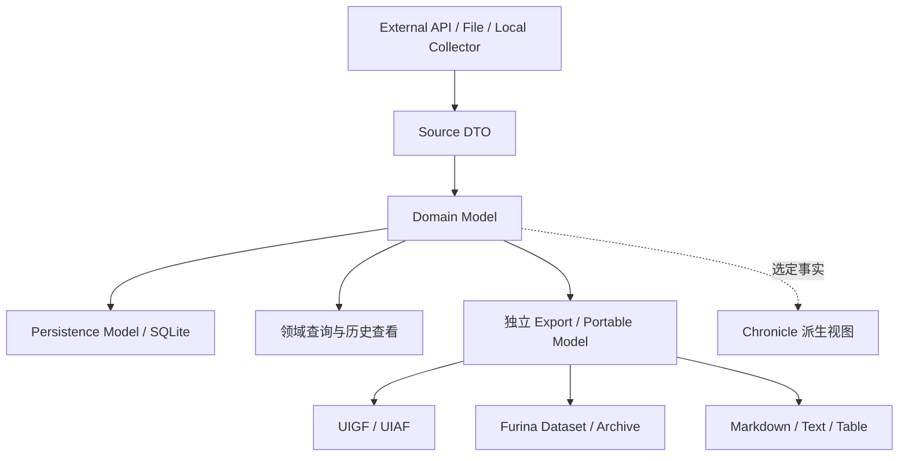

# 架构总览

状态：Target

## 产品与架构的从属关系

FurinaChronicle 是本地优先的原神个人历史档案工具。架构遵循 [项目宪章](../project/PROJECT_CHARTER.md) 的领域自治、数据优先、开放导出、Chronicle 派生四项原则；共享基础只解决真实领域的共同需求，不建设通用数据平台。

## 分层



各领域的规范化事实同时服务独立查询、历史查看和导出；Chronicle 作为后续读取消费者选择部分事实投影。未来 Sync 是可选消费者，不是当前 Portable Model 或领域实现的前置条件。

## 项目职责

- `FurinaChronicle.Core`：身份、领域记录、值对象和纯领域规则。
- `FurinaChronicle.Services`：用例、端口、导入计划、合并策略和事务边界。
- `FurinaChronicle.Infrastructure`：SQLite、HTTP、JSON、压缩、文件格式和外部 Provider。
- `FurinaChronicle.App`：MAUI 页面、平台文件选择、导航和用户交互。

Core 不得引用 MAUI、SQLite、平台存储、HTTP 客户端或具体外部 DTO。

## 统一领域能力原则

需要长期保存的领域原则上逐项考虑以下能力；不适用项应在领域计划中说明，不为清单提前建立复杂通用框架。

| 能力 | 职责 |
|---|---|
| Domain Model | 保存该领域的规范化事实、身份、时间、来源和完整性 |
| Repository / Persistence | 安全保存与读取当前及历史记录 |
| Acquisition / Import | 将实际 Provider、标准文件、领域文件或手工输入转换为事实；早期纵切可用 fixture |
| Query | 独立查询，不以 ChronicleEntry 为返回事实的唯一方式 |
| 历史查看 | 查看事件、观察、修订或差异；首批可以用查询与可读导出验证，不要求完整 UI |
| 人类可读 Export | Markdown、文本、表格等，用于外部查看、归档和分析 |
| 机器可读 Portable / Standard Export | 适用时使用标准或 Furina 载荷带走领域数据，保留可重导入所需语义 |
| Chronicle Contributor | 适用时选择领域事实供综合展示，在领域独立保存、查询和导出后验证 |

Contributor 不是领域成立的必要条件。没有进入 Chronicle 的数据不得因此被视为次要、临时或不需要长期保存。背包、资源流水和高频状态观察可以主要用于领域查询、统计与导出；数据保留依据领域策略和来源证据，不依据 Profile 是否显示。

## 数据层级

```text
Source Evidence
      ↓
Normalized Record
      ↓
Derived Record
      ↓
Projection
```

- 来源证据说明数据来自哪里。
- 规范化记录统一内部结构，但不代表绝对真实。
- 派生记录由基础数据计算或推断。
- 投影面向查询、UI、统计和报告，可随时重建。

Chronicle 游戏历程是跨数据域的派生投影，不是新的事实表。抽卡、挑战、角色状态等领域通过贡献者生成统一时间线候选条目，再由主时间线和领域时间线 Profile 决定默认可见性；导入、覆盖、撤销和删除等档案操作使用独立的操作历史。具体见 [Chronicle 时间线架构](CHRONICLE_TIMELINE.md) 和 [Chronicle 产品需求](../specifications/CHRONICLE_PRODUCT_REQUIREMENTS.md)。

Identity、Time、Provenance、Completeness 等真正共同的语义可以共享。`ChronicleEntry`、`EntryId`、`ProjectionSequence`、Profile 和分页游标属于 Chronicle 子系统，不得为了综合查询方便反向塑造领域模型。Portable 导出领域事实，不依赖 Chronicle 投影或 SQLite 行。

## 实施与冻结边界

Phase 8B 先建立足以承载多个独立领域的最小共享基础，再证明不同领域能够独立保存、查询、导出和参与 Chronicle。只有涉及已存数据解释、跨端实体身份、公开格式兼容或不可逆迁移风险的问题，才进入 8B.0 最小共享门槛；具体领域 Schema、Chronicle 查询细节和未来同步下放到相应工作包。详见 [Phase 8B 实施计划](../project/PHASE_8B_PLAN.md)。

首次持久化或公开导出前仍必须冻结实际采用的字段和引用规则，并提供验证 fixture。缩小全局门槛不意味着可以静默选择不可逆语义。

## 当前实现与目标模型

当前数据库使用 `PlayerArchive → GameAccount → GachaRecord`，`GachaRecord` 通过 `GameAccountId` 归属档案内账号副本。Schema 3 已增加 `GameRoleIdentity` 与 `GameAccount.GameRoleIdentityId`：不同档案中的账号副本仍独立保存业务记录，但可以共享同一个稳定角色身份。无法形成合法自然身份的旧占位账号保留为空引用，并在领域模型中表现为 `Unresolved`。

当前主数据库 Schema 版本为 3，抽卡表名为 `GachaRecords`。应用启动时会在事务中依次执行已知迁移：版本 1 的历史表 `WishRecords` 迁移为 `GachaRecords`，版本 2 的账号按规范自然身份迁移到共享身份表。迁移保留原业务记录和外键；历史名称不得扩散到迁移边界之外。

未知/未来数据库版本或 application ID 不匹配时停止写入、保留原库；仅明确的新空库允许初始化。已知迁移在事务中执行，失败回滚且不删表重建。Schema 3 成功升级后不提供数据库降级；旧版客户端必须把它视为未来版本并安全拒绝写入。

服务端能力通过端口扩展，Core 和本地数据库不依赖服务端存在。
